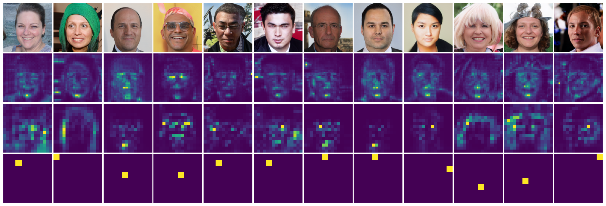

# LadaGAN
This repo is the official implementation of "[Efficient generative adversarial networks using linear additive-attention Transformers](https://arxiv.org/abs/2401.09596)".

</img>

By Emilio Morales-Juarez and Gibran Fuentes-Pineda.


## Abstract
> Although the capacity of deep generative models for image generation, such as Diffusion Models (DMs) and Generative Adversarial Networks (GANs), has dramatically improved in recent years, much of their success can be attributed to computationally expensive architectures. This has limited their adoption and use to research laboratories and companies with large resources, while significantly raising the carbon footprint for training, fine-tuning, and inference. In this work, we present LadaGAN, an efficient generative adversarial network that is built upon a novel Transformer block named Ladaformer. The main component of this block is a linear additive-attention mechanism that computes a single attention vector per head instead of the quadratic dot-product attention. We employ Ladaformer in both the generator and discriminator, which reduces the computational complexity and overcomes the training instabilities often associated with Transformer GANs. LadaGAN consistently outperforms existing convolutional and Transformer GANs on benchmark datasets at different resolutions while being significantly more efficient. Moreover, LadaGAN shows competitive performance compared to state-of-the-art multi-step generative models (e.g. DMs) using orders of magnitude less computational resources. 


## Dependencies
- Python 3.9
- Tensorflow <= 2.13.1

A conda environment can be created and activated with:
```
conda create --name tf13 python=3.9.16
conda activate tf13
pip install tensorflow[and-cuda]==2.13.1 
pip install numpy matplotlib pillow scipy tqdm huggingface-hub
```


## Training LadaGAN
Use `--file_pattern=<file_pattern>` and `--eval_dir=<eval_dir>` to specify the dataset path and FID evaluation path.
```
python train.py --file_pattern=./data_path/*png --eval_dir=./eval_path/*png
```


## FLOPs
Using a single 12GB GPU (RTX 3080 Ti) for training on CIFAR-10 and CelebA datasets takes less than 35 hours:
| Model (CIFAR 10 32x32) | ADM-IP (80 steps) | StyleGAN2 |  VITGAN  | LadaGAN  |
| :-- |  :------:  |  :------:  |  :------:   |  :------:  |
| GPUs | Tesla V100 x 2| - |- | __RTX 3080 Ti x 1__ |
|   #Images | 69M |200M |- | __68M__ |
| #Params | 57M | - |- | __19M__ |
| FLOPs | 9.0B | - | - | __0.7B__ |
| FID | __2.93__| 5.79 |4.57 | 3.29 |

| Model (CelebA 64x64)  | ADM-IP (80 steps) | StyleGAN2 |  VITGAN  | LadaGAN  |
| :-- |  :------:  |  :------:  |  :------:   |  :------:  |
| GPUs | Tesla V100 x 16| - |- | __RTX 3080 Ti x 1__ |
|   #Images | 138M |- |- | __72M__ |
| #Params | 295M | 24M | 38M | __19M__ |
| FLOPs | 103.5B | 7.8B |2.6B | __0.7B__ |
| FID | 2.67| -|3.74 | __1.81__ |

| Model (FFHQ 128x128)  | ADM-IP (80 steps) | StyleGAN2 |  VITGAN  | LadaGAN  |
| :-- |  :------:  |  :------:  |  :------:   |  :------:  |
|   #Images  | 61M | - |  - | __53M__ |
| #Params | 543M | - | - | __24M__ |
| FLOPs | 391.0B| 11.5B |11.8B| __4.3B__ |
| FID| 6.89| - | -| __4.48__ |


## Hparams setting
Adjust hyperparameters in the `config.py` file.

Implementation notes:
- This model depends on other files that may be licensed under different open source licenses.
- LadaGAN uses [Differentiable Augmentation](https://arxiv.org/abs/2006.10738). Under BSD 2-Clause "Simplified" License.
- [FID](https://arxiv.org/abs/1706.08500) evaluation.
- Efficient patch generation with XLA.


## Demo
[](https://colab.research.google.com/drive/1ZS7pSxh_-PLSFAcJwuG0WCejD5cRTg9C?)


## Attention maps
Single head maps training progress:

</img>
</img>

## BibTeX
```bibtex
@article{morales2024efficient,
  title={Efficient generative adversarial networks using linear additive-attention Transformers},
  author={Morales-Juarez, Emilio and Fuentes-Pineda, Gibran},
  journal={arXiv preprint arXiv:2401.09596},
  year={2024}
}
```


## License
MIT
